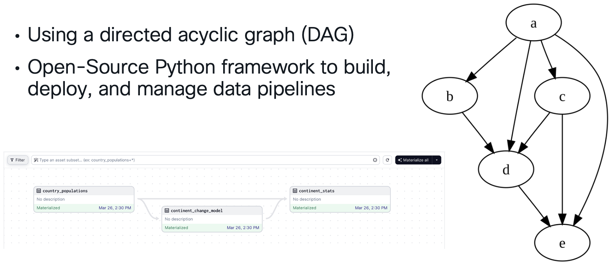

# Data Pipelines for Cisco Networks

Instead of custom Python scripts you can use a stable data engineering Python framework to extract data from your cisco devices.

In this example we use the framework dagster to extract data from **Cisco Catalyst Center** and **SD WAN**.



## First Steps

### Installation

Git clone and run:

```
dagster dev -f pipeline-catalyst-center.py
```

### Company-wide Data Architecture

If your company is already using a data lake house / data warehouse, you can use the existing platform to ingest data.


### Cisco APIs Overview


## Versioning


**1.0** - Inital commit.

## Authors

* **Flo Pachinger** - *Initial work* - [flopach](https://github.com/flopach)

## License

This project is licensed under the Cisco Sample Code License 1.1. - see the [LICENSE.md](LICENSE.md) file for details

## Further Links

* [Cisco DevNet Website](https://developer.cisco.com)
* [MV Sense API](https://developer.cisco.com/meraki/mv-sense/#!overview)