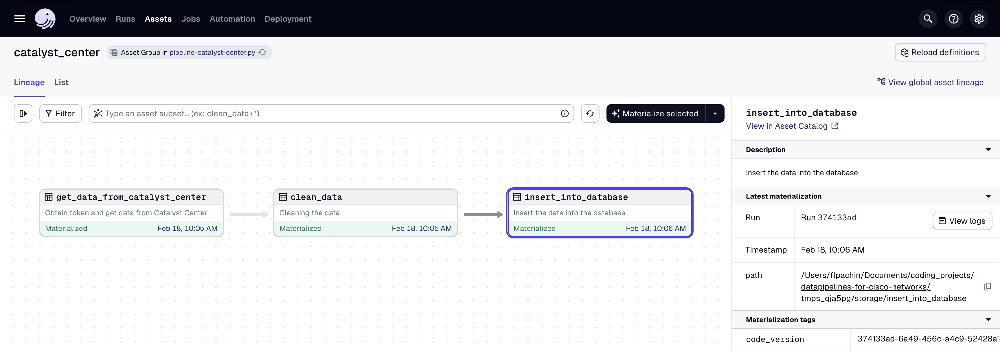
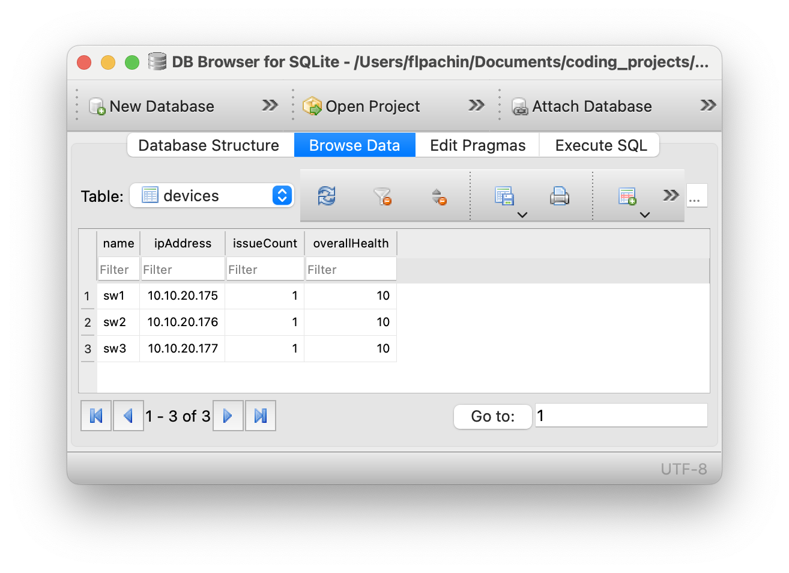
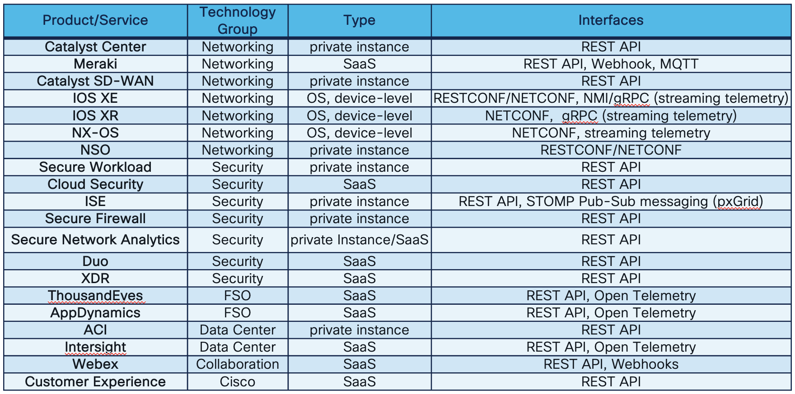
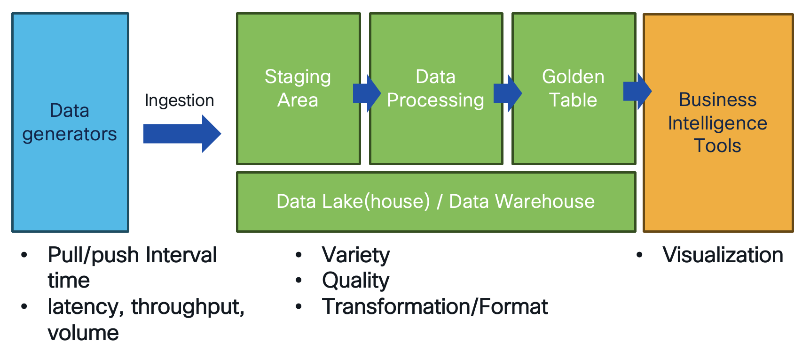

# Data Pipelines for Cisco Networks

Instead of custom Python scripts you can use a stable data engineering Python framework to extract data from your cisco devices.

In this example we use the [data engineering Python framework dagster](https://dagster.io/) to extract data from **Cisco Catalyst Center** and **SD WAN**.

**Example pipeline**:



**Desired Output** - data in your relational database:



## First Steps

### Installation

1. Run in your terminal:

```
git clone &&
dagster dev -f pipeline-catalyst-center.py
```

2. Open [http://127.0.0.1:3000/](http://127.0.0.1:3000/) to execute and view logs of your pipeline.

### Cisco APIs Overview



### Company-wide Data Architecture

If your company is already using a data lake house / data warehouse, talk to your data engineer team if you can use the existing platform to ingest data.



## Versioning


**1.0** - Inital commit.

## Authors

* **Flo Pachinger** - *Initial work* - [flopach](https://github.com/flopach)

## License

This project is licensed under the Cisco Sample Code License 1.1. - see the [LICENSE.md](LICENSE.md) file for details

## Further Links

* [Cisco DevNet Website](https://developer.cisco.com)
* [DevNet Sandboxes](https://devnetsandbox.cisco.com)